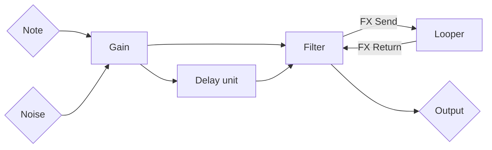

Square Wave
===========

Noise synth for killing time.

Signal diagram
--------------

Looper
------

The top bar is a looper. It's set to play automatically by default. Press record to start buffering the current audio, and then press again to finish the loop. The looper will record its own output, but it doesn't overdub--it creates a new loop from what it records.

Synth
-----

The synthesizer is controlled by the touch area. It has the following modes, activated via buttons the left:

* NOTE - Plays a square wave. X = gain, Y = frequency
* NOISE - Plays noise. X = gain, Y = playback rate/pitch shift
* BANDPASS - Applies a bandpass filter to the signal. X = resonance, Y = frequency
* CHORUS - Very short delay. X = depth (up to five duplicates), Y = delay time
* DELAY - Same as CHORUS but the delays are much longer

Fun tricks
----------

* Apply a short chorus to the noise filter to create a bitcrush-like effect
* Loop a pad, then filter it and record again to create more of a drone track
* Slide left along the bottom of the noise pad to create a bass drum, then tap near the top for a hi hat
* Tap the very left side of the pad in DELAY or CHORUS to turn off the effect
